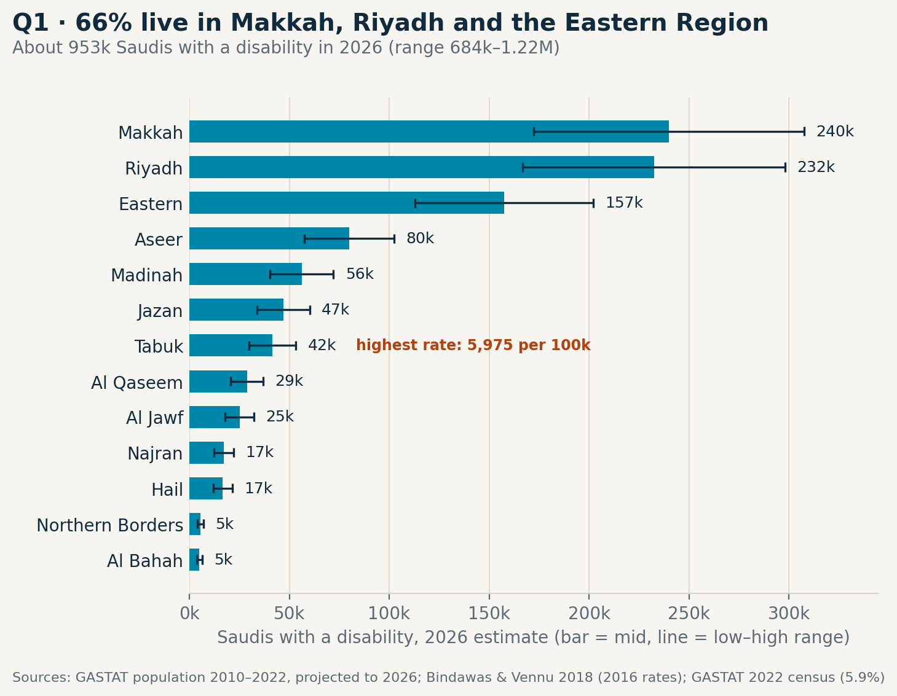
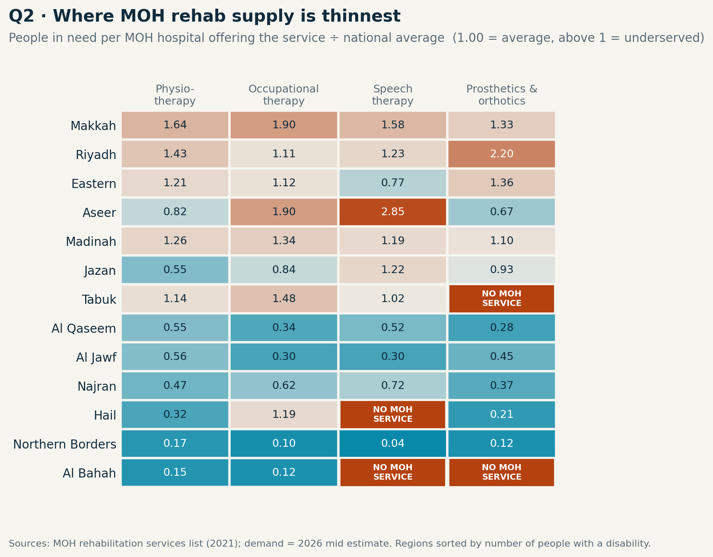
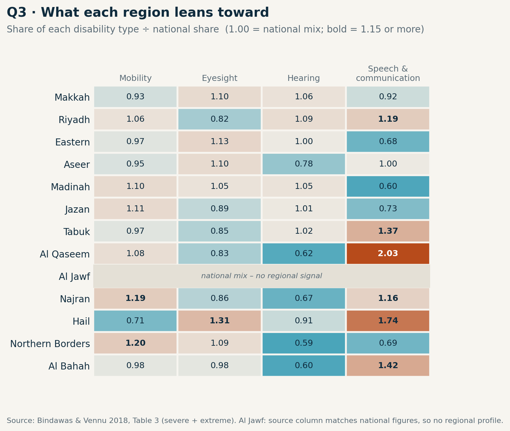
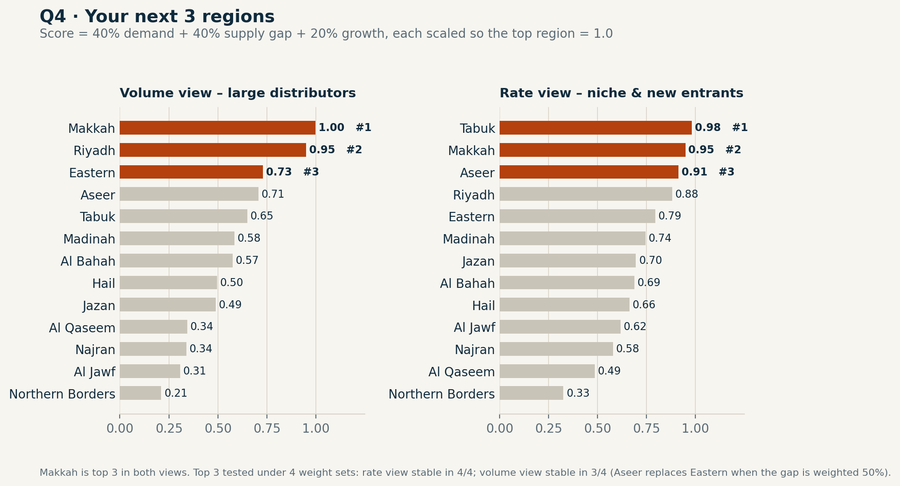

# Where to grow next: rehab demand vs supply across Saudi regions (2026)

**Case Study 2 · Medical Research & Data Analysis · Dr. Muhammad Ali, DPT**

Which Saudi regions have the most people with a disability, where is MOH rehabilitation supply thinnest, what does each region need, and where should a rehab or medical-device company go first?

This project answers those four questions with public data only, for companies selling rehabilitation services, mobility aids, prosthetics & orthotics, and hearing or communication devices in Saudi Arabia.

---

## Key findings

| # | Question | Answer |
|---|---|---|
| Q1 | Where do people with disabilities live? | About **953,000 Saudis** will have a disability in 2026 (range **684,000 – 1.22 million**). **66%** live in Makkah, Riyadh and the Eastern Region. **Tabuk** has the highest rate (5,975 per 100,000). |
| Q2 | Where is the supply gap? | **Tabuk** has 17,481 people with a mobility disability and **no MOH prosthetics & orthotics hospital**. **Riyadh** has 1 MOH P&O hospital per **53,304** people with a mobility disability, against a national average of 24,220 (**2.2×**). **Aseer** carries 2.85× the national load for speech therapy. **Makkah** is above the national load on all four services. |
| Q3 | What does each region need most? | Mobility is the largest need everywhere (43% nationally). Speech & communication is over-represented in **Al Qaseem, Hail, Al Bahah, Tabuk and Riyadh**; Hail and Al Bahah have no MOH speech therapy. |
| Q4 | Where should you go first? | **Large distributors:** Makkah → Riyadh → Eastern Region. **Niche or new entrants:** Tabuk → Makkah → Aseer. Makkah is in the top 3 in all 8 sensitivity tests. |






---

## Method

The work runs in two notebooks. Every step ends with an automatic check (`assert`); a step that fails stops the notebook.

**Notebook 1 – `cs2_01_clean.ipynb` (Stage 1: cleaning)**

| Step | What it does | Check |
|---|---|---|
| 1.1 | Region lookup: 28 spellings mapped to 13 official GASTAT region names | zero unmatched names in all 5 sources |
| 1.2 | Population 2010–2022, Saudi and non-Saudi | 2022 totals match the census exactly (18,792,262 Saudis) |
| 1.3 | 2016 disability rates recomputed from raw counts | totals match the paper; national rate 3.33% |
| 1.4 | Disability type mix per region (severe + extreme, and all levels) | every region sums to 100% |
| 1.5 | MOH hospitals offering each rehab service, by region | 235 hospitals; totals match the source list |
| 1.6 | National reference values (2022 census, 2023 survey) | every value matches the PDF |
| 1.7 | 2024 health-system context (background only) | totals match the publication |
| 1.8 | Gate: all clean files share the same 13 regions, no duplicates | passed |

**Notebook 2 – `cs2_02_analysis.ipynb` (Stage 2: analysis)**

| Step | What it does |
|---|---|
| 2.2 | **Backtest:** data up to 2018 used to predict 2022. Mean absolute error 0.28% (recent growth) and 0.32% (long-term growth); worst region 0.66%. |
| 2.3 | Saudi population projected to 2026 (low / mid / high). **Validated** against GASTAT's published mid-2024 estimate (19.6 million): within +0.2% to +0.6%. |
| 2.4 | Disability rates: low = 2016 regional rates; high = the same pattern scaled (×1.7707) so the national total equals the 2022 census rate of 5.9%. Scaling does not change the regional ranking. |
| 2.5 | Q1 – people with a disability in 2026 per region |
| 2.6 | Q3 – type mix per region, as an index against the national mix (1.15 or more = region leans toward that type) |
| 2.7 | Q2 – people in need per MOH hospital offering each service, against the national average. Each service is matched to the people who need it (e.g. prosthetics & orthotics ↔ mobility disability). Zero-service regions are flagged, never divided by zero. |
| 2.8 | Q4 – score = 40% demand + 40% supply gap + 20% population growth, in a volume view and a rate view; top 3 re-tested under 4 weight sets |
| 2.10 | Gate: every headline number recomputed from the saved files and reconciled with its result table |

---

## Data sources

| ID | Source | Year | Used for |
|---|---|---|---|
| D1 | GASTAT – Population by region, nationality and gender (CSV) | 2010–2022 | population and growth |
| D2 | Bindawas SM, Vennu VS. *The National and Regional Prevalence Rates of Disability, Type of Disability and Severity in Saudi Arabia – Analysis of 2016 Demographic Survey Data.* Int J Environ Res Public Health 2018;15(3):419. [doi:10.3390/ijerph15030419](https://doi.org/10.3390/ijerph15030419) (CC BY 4.0) | 2016 | regional rates (Table 2) and type mix (Table 3) |
| D3 | Ministry of Health – List of Medical Rehabilitation Services in MOH Hospitals (PDF) | 2021 | rehab supply |
| D4 | [GASTAT – Persons with Disability Statistics Report 2023](https://www.stats.gov.sa/documents/20117/2435273/Persons_with_Disability_Statistics_Report_2023_en_(1).pdf_fixed_9782258/9ceaa5f3-383d-b8af-5769-bbccd083580f) | census 2022 / survey 2023 | national rate (5.9% of Saudis) |
| D5 | [GASTAT – Healthcare Establishments and Workforce Statistics 2024](https://www.stats.gov.sa/documents/20117/2435273/Healthcare+Establishments+and+Workforce+Statistics+Publication+2024+EN+(1).pdf/a9775b6f-5333-c2d7-4f32-dcb5d8c549b0?t=1761133676741) | 2024 | context only |
| – | [GASTAT – Population Estimates 2024](https://www.stats.gov.sa/documents/20117/2435273/Population+Estimates+Statistics+2024+EN.pdf/9b71e303-5fd9-19cb-9913-850a9d521639) | 2024 | validation of the projection |

PDF tables (D2–D5) were converted to Excel with Python (`pdfplumber`) and checked against the printed totals.

---

## Assumptions and limitations

1. **Only the population is projected to 2026.** Disability rates stay at their latest level; MOH supply stays at the 2021 list.
2. **Regional pattern from 2016.** The 2022 census gives only a national rate, so the regional pattern and type mix come from the 2016 survey. The low–high range reflects the gap between the 2016 definition (3.33%) and the 2022 census (5.9%).
3. **Supply = presence, not capacity.** A hospital counts once whether it has one therapist or fifty. MOH hospitals only; private and military providers and standalone clinics are not included. Hospitals opened after 2021 are missing, so gaps may be slightly smaller today.
4. **Scope: Saudi citizens.** The 2016 regional rates cover Saudi citizens only.
5. **Two source issues found and handled:**
   - The 2016 survey population (20.1 M Saudis) is 23% above GASTAT's revised 2016 estimate (16.4 M). Only rates are taken from 2016, so the analysis is unaffected; Al Bahah shows the largest gap (+73%) and its rate is the least reliable.
   - In Table 3 of the 2016 paper, the Al-Jouf column matches the paper's national figures almost exactly (index 0.99–1.04 on every type). It most likely holds national values, so Al Jawf has no regional type profile in Q3.

---

## Repository structure

```
├── notebooks/
│   ├── cs2_01_clean.ipynb       Stage 1 – cleaning and checks
│   └── cs2_02_analysis.ipynb    Stage 2 – analysis, Q1–Q4, charts
├── data/
│   ├── raw/                     D1–D5 as downloaded / converted
│   ├── clean/                   one clean CSV per source
│   └── final/region_master.csv  one row per region, all results
└── outputs/
    ├── tables/                  backtest, projection, Q1–Q4 tables, headline numbers
    └── figures/                 the four charts above
```

## How to reproduce

1. Copy the repository folder into Google Drive as `MyDrive/cs2-regional-demand`.
2. Open `notebooks/cs2_01_clean.ipynb` in Google Colab and select **Runtime → Run all**.
3. Open `notebooks/cs2_02_analysis.ipynb` and select **Runtime → Run all**.

Every check prints its result; the notebooks stop if any check fails.

---

**Dr. Muhammad Ali, DPT** – Independent Data Analyst · muhammadali17598@gmail.com · [GitHub](https://github.com/MightyAli98)

Tools: Python (pandas, matplotlib), Google Colab, Power BI.
